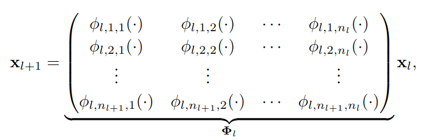

# KANs
an implementation of KANs in pytorch, to present to class for 5 marks and some notes to revisit and understand it

---

# Theory (Intro)
Explaining the [paper](https://arxiv.org/pdf/2404.19756)

### Kolmogorov Arnold Representation Theorem

**Theorem:** It states that every multivariate function (function with multiple inputs but a single output) can be expressed as a two layered sum of single variable functions.

Let $f: [0, 1]^{n} \rarr \mathbb{R}$ $$f(x_1, x_2, .., x_n) = \sum_{q=1}^{2n+1} \phi_{q} (\sum_{p=1}^{n} \psi_{p,q}(x_p))$$ where $\phi_{p}: \mathbb{R} \rarr \mathbb{R}$  and $\psi_{p,q}: [0, 1] \rarr \mathbb{R} $

### Kolmogorov Arnold Networks

Now the neural network is laid such that these $\phi_p \space \&\space \psi_{p,q}$ are learnable functions. In the paper they are defined are splines where the control points are learned.

### Innovation

The possiblity of using Kolmogorov Arnold representation theorem to build a neural network has been studied, however most work has stuck to using a two layered system. The innovation lies is using multiple layers to achieve better and faster convergenece. 

(source: the paper)
"Despite their elegant mathematical interpretation, KANs are nothing more than combinations of
splines and MLPs, leveraging their respective strengths and avoiding their respective weaknesse" 

# Paper

### section 2: architecture 

(source: the paper)
The breakthrough occurs when we notice the analogy between MLPs and KANs. In MLPs, once we define a layer (which is composed of a linear transformation and nonlinearties), we can stack more layers to make the network deeper. To build deep KANs, we should first answer: “what is a KAN layer?” It turns out that a KAN layer with $n_{in}$-dimensional inputs and $n_{out}$-dimensional outputs can be defined as a matrix of 1D functions.

#### Implementation Details
**Definition of spline**
In regular neural networks the existence of bias term contributes to the stablity of training, similarly here we add a bias like function called the basis function $b(x)$, which is added to the $spline(x)$

$$\phi_{l,p,q} = w_{b} b(x) + w_{s} spline(x)$$

in the paper $b(x) = silu(x) = x/(1 + e^{-x})$
and $$spline(x) = \sum_{i} c_i B_i(x)$$ where $B_i(x)$ are B-splines and $c_i$ are learnable weights

> Note: The existance of $w_b$ and $w_s$ are redundent due to the presence of $c_i$.

**Inititialization**
$w_b$ is initialized to 1 and $spline(x) = 0$
Draw B-spline coefficients $c_i \sim N(0, \sigma^{2})$ with a small $\sigma$, typically we set $\sigma = 0.1$

**Update rule**
(source: paper)
Update of spline grids. We update each grid on the fly according to its input activations, to address the issue that splines are defined on bounded regions but activation values can evolve out of the fixed region during training.

#### Parameter count

$L \rarr$ number of layers
$N \rarr$ max neuron (for worst case scenario)
$k \rarr$ spline order on $G$ intervals

parameter count = $O(N^{2}L(G+k)) \sim O(N^2LG)$

#### Approximation and scaling laws
